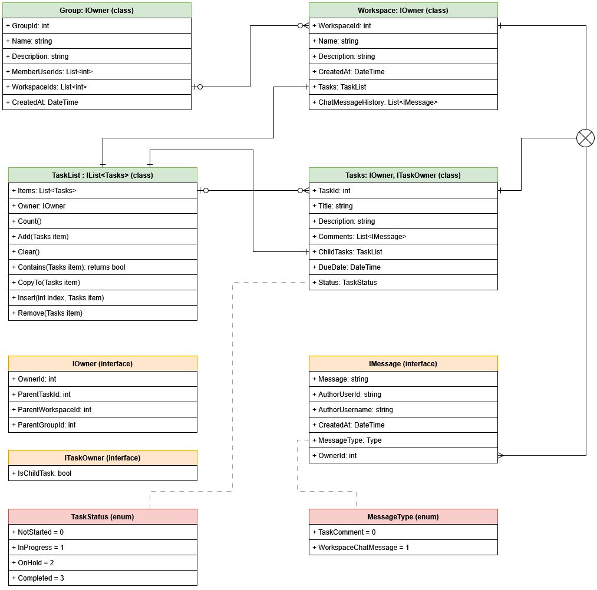

# Synopsis

The purpose of this SharedCommon library is to setup some kind of starting point for out initial object layouts and schema, based on previous technical discussions. This library can be pulled in by FE/BE to have a common uniformed set of classes to work with, and be viewed by other team members to have an understanding of how class schema is setup.

## IMessage

The IMessage interface can be used to represent comments on tasks, or chat messages in a workspace.
It has basic values like Message, AuthorUserId, AuthorUsername, and a CreatedAt timestamp.
Then is has a public enum for MessageType, which will either be TaskComment (which is 0) or WorkspaceChatMessage (which is 1). Then, it has an OwnerId field. The jist here is if the Type is type TaskComment, then we assume the OwnerId points to a unique Task's Id. And if the Type is type WorkspaceChatMessage, then we assume the OwnerId points to a unique Workspace's Id. The OwnerId of a message will never be a user profile Id, only the Id of a task or workspace.

## IOwner

The IOwner interface is applied to all 'working' object types (Task, Workspace, Group). These enforce 4 optional fields: OwnerId (user profile Id of the object's owner), ParentTaskId (task Id of the parent task over a child task), ParentWorkspaceId (workspace Id that owns a parent task and its subsequent child tasks), and ParentGroupId (group Id that owns a group of workspaces and their subsequent tasks).

## ITaskOwner

This is a simple interface that only applies to tasks and workspaces - basically any object that directly 'holds' a TaskList collection.

## Tasks

The Tasks object implements the following:
   * int named TaskId
   * string named Title
   * string named Description
   * List<IMessage> named Comments
   * TaskList named ChildTasks
   * DateTime named DueDate
   * TaskStatus named Status (TaskStatus is a custom enum declared in the Tasks.cs file)
   * all the IOwner and ITaskOwner implementations

## TaskList

The TaskList is a custom IList implementation that tracks the IOwner when created. So if a Workspace or Tasks object is created, the TaskList gets a reference to its parent object. The `Add` method is intercepted with custom logic to ensure Tasks objects have their IsChildTask boolean flipped to `true` when added (this will enforce rules so a parent task's child tasks don't have inifinitely nested child tasks).

## Workspace

The Workspace object implements the following:
   * int named WorkspaceId
   * string named Name
   * string named Description
   * DateTime named CreatedAt
   * List<IMessage> names ChatMessageHistory
   * TaskList named Tasks
   * all the IOwner and ITaskOwner implementations

## Group

The Group object implements the following:
   * int named GroupId
   * string named Name
   * string named Description
   * List<int> named MemberUserIds
   * List<int> named WorkspaceIds
   * DateTime named CreatedAt
   * all the IOwner implementations (since a Group is sort of a 'higher level' object, this would only ever need to use the OwnerId field to associated the user Id of the user profile who 'owns' the group)

## SchemaMapping

The `SchemaMapping` class (see `Schema/SchemaMapping.cs`) provides a single and centralized place to declare and manage all API endpoints, their corresponding stored procedure names, parameter schemas, and any associated DTOs in the CommonLib. In the backend project it is setup via a `global using static` so the information is available throughout the codebase with a single declaration.

Synopsis of what `SchemaMapping` outlines:
   * A single list of API definitions that describe endpoint routes, HTTP methods, the stored procedure they map to, the CLR return type, and whether the endpoint returns a collection.
   * Enum controlled identifiers (`ApiEndpoints` and `StoredProcedures`) so code can reference endpoints and procedures by name rather than hard-coded strings.
   * Dictionaries that make it trivial to look up route templates, HTTP method, return type, and whether the result is a collection for any endpoint.
   * A typed description of stored procedure parameters so call sites can check parameters consistently.

This arrangement is meant to keep API routing, databasee procedure names, and schema types unified in one place and reduces  errors and maintenance.